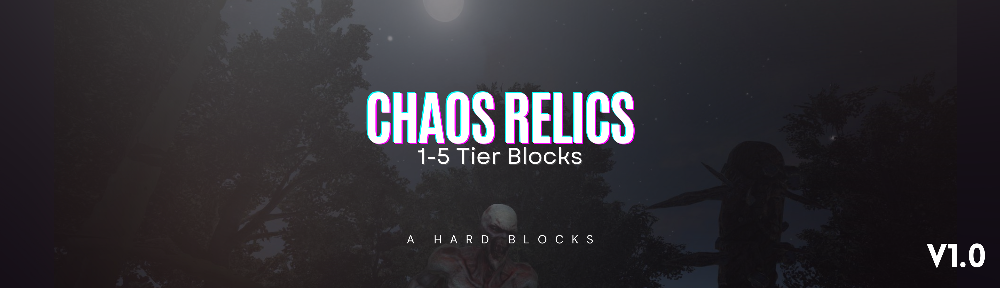

  

  <h1 align="center">Chaos Relics - Adamantum Tier Blocks - v1.0</h3>

  

    (Server side only / server friendly)
     
    Nexusmods: https://www.nexusmods.com/7daystodie/mods/5602
     
  

Change Version 1.0-a

- Added Burning Damage.
  Blocks now inflict burning damage when interacted with or when walked on. The burning damage varies by tier;

* Tier 1 Burn Damage: 1.5 (Target All).
* Tier 2 Burn Damage: 3 (Target All).
* Tier 3 Burn Damage: 6 (Target All).
* Tier 4 Burn Damage: 9 (Target All).
* Tier 5 Burn Damage: 13.5 (Target All).
