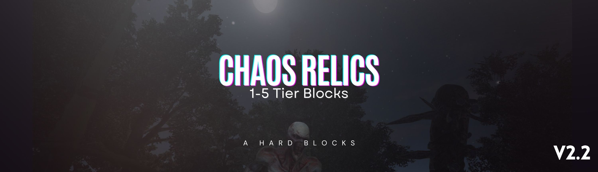

  

  <h1 align="center">Chaos Relics - Adamantum Tier Blocks - v2.2</h3>

  

    (Server side only / server friendly) - Compatible with 7 Days to Die v2.2
     
    Nexusmods: https://www.nexusmods.com/7daystodie/mods/5602
     
  

## Change Version 2.2

- Updated for 7 Days to Die v2.2 compatibility
- Removed burning damage effects for better performance
- Optimized block properties for latest game version
- Improved stability and compatibility

## Previous Changes (Version 1.0-a)

- Added progressive tier blocks with high durability
- Enhanced explosion resistance for all tiers
- 5 different tiers: Mythril, Stellar, Quantum, Cobalt, and Adamantum

### Block Tiers:
* **Tier 1 (Mythril)**: Enhanced durability and stability
* **Tier 2 (Stellar)**: Increased resistance and strength  
* **Tier 3 (Quantum)**: Advanced protection capabilities
* **Tier 4 (Cobalt)**: Superior defensive properties
* **Tier 5 (Adamantum)**: Ultimate tier with maximum protection
